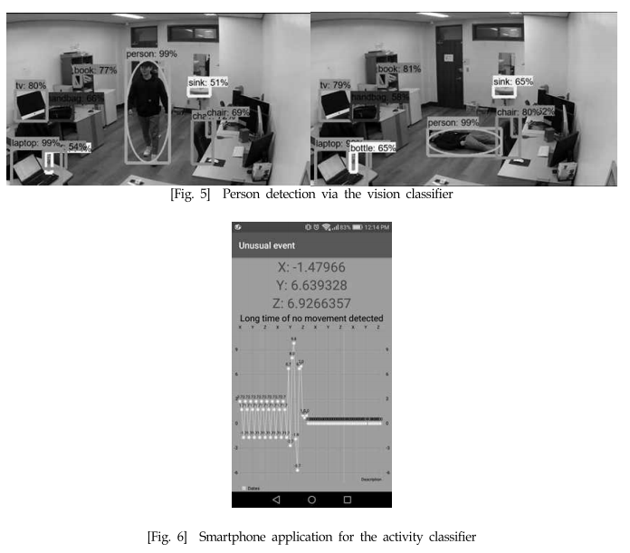

# My-papers

My Paper List

1. Personalized Unusual Event Detection Algorithm at Smart Home via Daily Activity and Vision Pattern
- ObjectDetection+gyroscope
2. 고독사 예방을 위한 영상 및 음성패턴 기반 맞춤형 이상 징후 탐지 알고리즘 
- ObjectDetection + SoundPattern
3. Unusual Event Detection Algorithm via Personalized Daily Activity and Vision Patterns for Single Households 
- Waiting for publication, ObjectDetection+gyroscope

